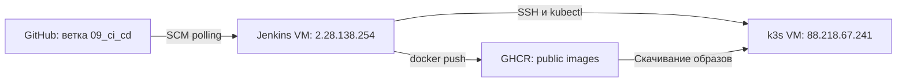

# Tech Support Ticket Service

Приложение для заведения и обработки тикетов.

## Запуск через Docker Compose

Для запуска всего стенда одной командой:

```bash
docker compose up -d --build
```

## Проверка состояния:
docker compose ps -a

Ожидаемое состояние:
backend — Up
frontend — Up
keycloak — Up (healthy)
postgres — Up (healthy)
init-db — Exited (0)

## Остановка:
docker compose down
Без -v, если не нужно удалять данные PostgreSQL и Keycloak.

## Стенд
Приложение:
https://88-218-67-241.sslip.io

Keycloak:
https://auth.88-218-67-241.sslip.io

OIDC issuer:
https://auth.88-218-67-241.sslip.io/realms/tech-support

HTTPS завершается на nginx.
Сертификат выдан Let's Encrypt для:
88-218-67-241.sslip.io
auth.88-218-67-241.sslip.io

Порт 80 используется для HTTP-01 challenge и редиректа на HTTPS.

## Переменные окружения

Для запуска:
`docker compose up -d`
- Запуск: `.\dev.ps1` - скрипт запускает backend и frontend и открывает приложение в браузере.

- Остановка: `.\devStop.ps1`

- Перезапуск: `.\devRestart.ps1`

Запуск вручную:
Backend: `.\gradlew.bat bootRun`
Frontend: `cd frontend`, `npm install`, `npm run dev`

Приложение будет доступно по `localhost:8080`. Swagger по `localhost:8080/swagger-ui/index.html`.

Для заполнения бд тестовыми данными отправь `curl http://localhost:8080/api/init-db` (или просто перейди по ссылке в браузере).

Для схемы в бд использую hibernate.ddl-auto: update, скриптов для миграции схемы нет.


## CI/CD через Jenkins

Для backend и frontend настроены отдельные Jenkins pipeline.
Обновления автоматически доставляются из ветки `09_ci_cd` 
в существующий k3s-кластер.

### Архитектура



Namespace приложения: `tech-support`.

CI/CD обновляет существующие Deployments `backend` и `frontend`.
Конфигурация PostgreSQL, Keycloak, Services, Ingress и PVC
в release pipeline не изменяется.

### Автоматический запуск

В обоих Jenkinsfile используется SCM polling:

```groovy
triggers {
    pollSCM('H/2 * * * *')
}
```

Для backend и frontend настроены отдельные Jenkins pipeline.
Сборка и deployment выполняются из ветки `main`.
Обе задачи используют Pipeline script from SCM:
backend — `Jenkinsfile`, frontend — `Jenkinsfile.frontend`.

### Backend pipeline

Этапы:

1. Checkout исходного кода.
2. Определение Git SHA.
3. Тестирование и сборка Gradle.
4. Публикация JUnit-отчётов в Jenkins.
5. Сборка Docker-образа.
6. Публикация образа в GHCR.
7. Deployment через SSH на Kubernetes VM.
8. Ожидание rollout и smoke test.

Команда тестирования и сборки:

```sh
./gradlew clean build --no-daemon --max-workers=2
```

### Frontend pipeline

Сборка выполняется внутри многостадийного Docker-образа:

1. Node.js: установка зависимостей через `npm ci`.
2. Node.js: production build через `npm run build`.
3. nginx: размещение собранной статики и nginx-конфигурации.

Jenkins передаёт SHA коммита через build argument `APP_VERSION`.
Dockerfile записывает его в `/usr/share/nginx/html/version.txt`.

После deployment проверяются:

- image reference в Deployment;
- совпадение `/version.txt` с SHA ожидаемой сборки;
- доступность `/api/version` через frontend nginx.

Для проверки версии и временных HTTP-ошибок предусмотрены
ограниченные повторные попытки


### Текущие ограничения
- Общий таймаут backend pipeline — 30 минут, frontend pipeline — 20 минут.
- Ожидание rollout каждого Deployment ограничено пятью минутами.
- Один executor и отсутствие фильтрации изменений по каталогам.
- Frontend pipeline проверяет сборку; отдельные unit-тесты
  и блокирующий `npm audit` этап не настроены.
- Автоматический rollback не настроен.
  Ошибка smoke test приводит к `FAILURE`,
  но не отменяет уже выполненное обновление Deployment.


## Общий план

0. ~~Create a basic crud.~~
1. ~~Implement a basic username/password auth.~~
2. ~~RBAC. Request, Support Agent, Team Lead, Admin roles with different permissions.~~
3. ~~Password storage side quest: encryption, hashing, salting.~~
4. ~~Session approach.~~
5. ~~Stateless Bearer token approach with JWTs.~~
6. ~~Secret storage side quest: store something like a JWT signing key or a pepper~~
7. ~~OAuth2/OIDC as a client integrating with an existing provider.~~
8. ~~Containerize the app. Make it possible to run everything with `docker compose up` (with flags when necessary).~~
9. ~~Side quest: HTTPS deployment.~~
10. ~~Kubernetes. Get the app running manually with kubectl. Handle both incoming and outgoing requests properly.~~
11. ~~CI/CD. Jenkins pipeline to deliver the updates~~
### История и внешняя интеграция

Обращения отображаются как `PROJECT_KEY-ID` (ID остаётся глобальным; при переносе меняется префикс). GET `/api/tickets/{id}/activity` возвращает историю статуса, исполнителя, названия, описания и проекта. Старые изменения не восстанавливаются; история начинается после обновления.

В карточке обращения можно загрузить название и состояние публичного GitHub issue. Backend обращается к `https://api.github.com/repos/{owner}/{repo}/issues/{number}`. Токен не требуется; действуют лимиты GitHub для анонимных запросов. Нужен исходящий HTTPS-доступ к api.github.com:443 и DNS. Для кластера с ограниченным egress разрешите этот адрес в используемой сетевой политике или service mesh; манифесты Istio не добавлены, поскольку в репозитории он не настроен. Запрос ограничен таймаутами и фиксированным хостом, перенаправления отключены. Документация: https://docs.github.com/en/rest/issues/issues#get-an-issue
