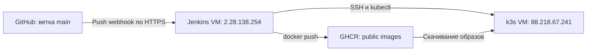

# Tech Support Ticket Service

Приложение для заведения и обработки тикетов.

## Требования и переменные окружения

Для Docker Compose нужны Docker Engine или Docker Desktop с Compose.
Для запуска без контейнеров нужны JDK 21, Node.js 22 с npm и PostgreSQL 17.
Gradle устанавливать отдельно не нужно: в проекте есть Gradle Wrapper.

Для Compose создайте `.env` в корне проекта и заполните переменные ниже.
Compose подставляет их в `compose.yaml`. При запуске через `bootRun`
файл `.env` автоматически не загружается: переменные нужно задать
в терминале или конфигурации запуска IDE.

| Переменная | Назначение |
| --- | --- |
| `JWT_SECRET` | Обязательный JWT-ключ в Base64; после декодирования — не менее 32 байт. |
| `PASSWORD_PEPPER` | Секрет для хеширования паролей; должен оставаться одинаковым для одной базы пользователей. |
| `POSTGRES_DB` | Имя базы PostgreSQL в Compose. |
| `POSTGRES_USER` | Пользователь PostgreSQL в Compose. |
| `POSTGRES_PASSWORD` | Пароль PostgreSQL в Compose. |
| `KEYCLOAK_ADMIN` | Начальная административная учётная запись Keycloak в Compose. |
| `KEYCLOAK_ADMIN_PASSWORD` | Пароль этой учётной записи. |
| `OIDC_CLIENT_ID` | ID клиента приложения в Keycloak; нужен для профиля `oidc`. |
| `OIDC_CLIENT_SECRET` | Секрет OIDC-клиента; нужен для профиля `oidc`. |
| `OIDC_ISSUER_URI` | Адрес OIDC issuer, доступный backend; нужен для профиля `oidc`. |
| `FRONTEND_URL` | Адрес frontend для возврата после OIDC-входа. |
| `DB_URL` | JDBC URL при запуске без Compose; по умолчанию `jdbc:postgresql://localhost:5432/ticketdb`. |
| `DB_USERNAME` | Пользователь базы при запуске без Compose; по умолчанию `ticketuser`. |
| `DB_PASSWORD` | Пароль базы при запуске без Compose; по умолчанию `ticketpass`. |

В Compose параметры подключения backend к базе формируются из
`POSTGRES_*` и передаются через `SPRING_DATASOURCE_*`.

## Запуск через Docker Compose

После подготовки `.env` запустите весь стек из корня проекта:

```bash
docker compose up -d --build
```

Текущий Compose включает профиль `oidc`, использует адрес Keycloak
опубликованного стенда и монтирует каталоги `/etc/letsencrypt`
и `/var/www/certbot` с хоста. Адреса OIDC и пути должны соответствовать
окружению запуска. Для локальной проверки по логину и паролю используйте
раздел «Локальная разработка».

Frontend публикует порты `80` и `443`. Backend и PostgreSQL доступны
внутри сети Compose; порты `8080` и `5432` на хост не опубликованы.
Публикация порта `443` сама по себе не включает HTTPS: для него нужна
конфигурация nginx с сертификатами. Текущий `frontend/nginx.conf`
обслуживает HTTP на порту `80`.

Проверка состояния:

```bash
docker compose ps -a
```

Ожидаемое состояние:

- `backend`, `frontend` — Up;
- `keycloak`, `postgres` — Up (healthy);
- `init-db` — Exited (0) после заполнения базы тестовыми данными.

Остановка с сохранением данных:

```bash
docker compose down
```

Добавление `-v` удалит volumes с данными PostgreSQL и Keycloak.

## Стенд

Приложение: [Tech Support](https://88-218-67-241.sslip.io).

Keycloak: [сервер авторизации](https://auth.88-218-67-241.sslip.io).

OIDC issuer:

```text
https://auth.88-218-67-241.sslip.io/realms/tech-support
```

HTTPS завершается на nginx.
Сертификат выдан Let's Encrypt для:
88-218-67-241.sslip.io
auth.88-218-67-241.sslip.io

Порт 80 используется для HTTP-01 challenge и редиректа на HTTPS.

## Локальная разработка

Команды ниже выполняются на компьютере разработчика из корня проекта.
Для обычного входа по логину и паролю профиль `oidc` не требуется.

### PostgreSQL

Подготовьте базу, соответствующую `DB_URL`, `DB_USERNAME` и `DB_PASSWORD`.
Например, отдельный локальный контейнер с настройками по умолчанию:

```powershell
docker run --detach --name ticket-local-postgres --publish 127.0.0.1:5432:5432 --env POSTGRES_DB=ticketdb --env POSTGRES_USER=ticketuser --env POSTGRES_PASSWORD=ticketpass postgres:17-alpine
docker exec ticket-local-postgres pg_isready -U ticketuser -d ticketdb
```

Перед запуском backend дождитесь ответа `accepting connections`.
Если нужная PostgreSQL уже работает, новый контейнер создавать не нужно.

### Backend

В PowerShell задайте переменные и запустите приложение.
Значения секретов в примере предназначены только для локальной разработки:

```powershell
$env:JWT_SECRET = "MDEyMzQ1Njc4OWFiY2RlZjAxMjM0NTY3ODlhYmNkZWY="
$env:PASSWORD_PEPPER = "local-development-pepper"
.\gradlew.bat bootRun --args="--spring.profiles.active=local --security.oidc.enabled=false"
```

На Linux/macOS используйте `export` для переменных и `./gradlew bootRun`.

Backend: [http://localhost:8080](http://localhost:8080).
Swagger: [http://localhost:8080/swagger-ui/index.html](http://localhost:8080/swagger-ui/index.html).

### Frontend

В другом терминале:

```powershell
npm --prefix frontend ci
npm --prefix frontend run dev
```

Интерфейс Vite: [http://localhost:5173](http://localhost:5173).
Запросы `/api`, `/oauth2` и `/login/oauth2` проксируются в backend.
Адрес `target` в `frontend/vite.config.js` должен совпадать с его портом.
В конфигурации репозитория используется `8080`. Если он занят, backend
можно запустить с `--server.port=18081`, временно изменив proxy на
`http://localhost:18081`.

После установки frontend-зависимостей backend и Vite также можно запустить
скриптом `.\dev.ps1`. Он использует переменные текущего терминала;
PostgreSQL нужно подготовить заранее. Для остановки и перезапуска есть
`.\devStop.ps1` и `.\devRestart.ps1`.

### Тестовые данные

Для заполнения локальной базы:

```powershell
curl.exe --fail http://localhost:8080/api/init-db
```

Если backend запущен на другом порту, замените его в URL.
Инициализация пропускается, если в базе уже есть пользователи.
Схема управляется через `hibernate.ddl-auto: update`; миграционных
скриптов Flyway/Liquibase в проекте нет.

## Проверка

Backend-тесты используют профиль `test` и H2 в памяти, с отдельными
тестовыми секретами. PostgreSQL и Keycloak для них не нужны.

На Windows, из корня проекта:

```powershell
.\gradlew.bat clean test bootJar
```

На Linux/macOS:

```bash
./gradlew clean test bootJar
```

HTML-отчёт тестов: `build/reports/tests/test/index.html`.

Проверки frontend:

```powershell
npm --prefix frontend ci
npm --prefix frontend run build
npm --prefix frontend run lint
```

В текущей проверке lint остаются 7 ошибок и 1 предупреждение, существовавшие
до улучшений обращений: синхронный `setState` внутри эффектов, функции
загрузки до объявления, совместный экспорт компонента и `useAuth`,
а также зависимость `loadAnalytics` в эффекте. Frontend build проходит,
но успешная сборка не означает успешный lint.

Для ручной проверки интерфейса проверьте название проекта, номер обращения,
сохранение истории после обновления страницы, ограничения разных ролей
и загрузку публичного GitHub issue. Unit-тесты GitHub-интеграции используют
имитацию API; исходящий доступ из Kubernetes проверяется отдельно.

## Версия backend

`GET /api/version` возвращает версию из свойства `version` в
`build.gradle.kts`. Задача `bootBuildInfo` создаёт
`META-INF/build-info.properties`, который включается в JAR.
Контроллер получает значение через Spring Boot `BuildProperties`.

При `version = "0.0.1-SNAPSHOT"` ответ endpoint — `0.0.1-SNAPSHOT`.
После изменения версии требуется новая сборка и запуск нового JAR/образа.
Метаданные можно проверить локально:

```powershell
Get-Content .\build\resources\main\META-INF\build-info.properties
curl.exe --fail http://localhost:8080/api/version
```

Версия backend из Gradle и SHA frontend в `/version.txt` — разные значения.


## CI/CD через Jenkins

Для backend и frontend настроены отдельные Jenkins pipeline.
Сборка и deployment настроены для ветки `main`.
После запуска release pipeline обновления доставляются в существующий
k3s-кластер. В настройках обеих задач Jenkins используется
Pipeline script from SCM с Branch Specifier `*/main`:
backend — `Jenkinsfile`, frontend — `Jenkinsfile.frontend`.

### Архитектура



Namespace приложения: `tech-support`.

CI/CD обновляет существующие Deployments `backend` и `frontend`.
Конфигурация PostgreSQL, Keycloak, Services, Ingress и PVC
в release pipeline не изменяется.

### Автоматический запуск

В обоих Jenkinsfile используется webhook-триггер:

```groovy
triggers {
    githubPush()
}
```

Периодический опрос отключён. GitHub отправляет событие `push` в Jenkins,
после чего плагин проверяет изменения в настроенной ветке `main`.

Для работы webhook нужны:

- плагин GitHub в Jenkins и включённый триггер
  `GitHub hook trigger for GITScm polling` в обеих задачах;
- webhook репозитория `badKOT/tech-support-ticket-service` с Payload URL
  `https://jenkins.2-28-138-254.sslip.io/github-webhook/`, типом
  `application/json` и событием `push`;
- одинаковый секрет в GitHub и Jenkins: credential типа `Secret text`
  выбирается в System → GitHub → Advanced → Shared secrets;
- проверка подписи SHA-256 и включённая проверка SSL в GitHub.

nginx на сервере Jenkins принимает HTTPS-запросы `/github-webhook/`
и передаёт их на `127.0.0.1:8080`. Веб-интерфейс Jenkins доступен через
SSH-туннель. API-токен GitHub для ручного создания webhook не требуется;
нужны права владельца или администратора репозитория.

Доставка проверяется в GitHub: Settings → Webhooks → выбранный webhook →
Recent Deliveries. Ответ `200` на `ping` подтверждает доставку уведомления.
Автоматический запуск сборки проверяется отдельно событием `push`.
Release pipeline включают deployment; для проверки ветки PR используется
отдельная задача без публикации образов и обновления Kubernetes.

### Backend pipeline

Этапы:

1. Checkout исходного кода.
2. Определение Git SHA.
3. Тестирование и сборка Gradle.
4. Публикация JUnit-отчётов в Jenkins.
5. Сборка Docker-образа.
6. Публикация образа в GHCR.
7. Deployment через SSH на Kubernetes VM.
8. Ожидание rollout и smoke test.

Команда тестирования и сборки:

```sh
./gradlew clean build --no-daemon --max-workers=2
```

### Frontend pipeline

Сборка выполняется внутри многостадийного Docker-образа:

1. Node.js: установка зависимостей через `npm ci`.
2. Node.js: production build через `npm run build`.
3. nginx: размещение собранной статики и nginx-конфигурации.

Jenkins передаёт SHA коммита через build argument `APP_VERSION`.
Dockerfile записывает его в `/usr/share/nginx/html/version.txt`.

После deployment проверяются:

- image reference в Deployment;
- совпадение `/version.txt` с SHA ожидаемой сборки;
- доступность `/api/version` через frontend nginx.

Для проверки версии и временных HTTP-ошибок предусмотрены
ограниченные повторные попытки.


### Текущие ограничения

- Общий таймаут backend pipeline — 30 минут, frontend pipeline — 20 минут.
- Ожидание rollout каждого Deployment ограничено пятью минутами.
- Один executor и отсутствие фильтрации изменений по каталогам.
- Frontend pipeline проверяет сборку; отдельные unit-тесты
  и блокирующий `npm audit` этап не настроены.
- Автоматический rollback не настроен.
  Ошибка smoke test приводит к `FAILURE`,
  но не отменяет уже выполненное обновление Deployment.

## История и внешняя интеграция

Обращения отображаются как `PROJECT_KEY-ID` (ID остаётся глобальным; при переносе меняется префикс).
GET `/api/tickets/{id}/activity` возвращает историю статуса, исполнителя, названия, описания и проекта.
Старые изменения не восстанавливаются; история начинается после обновления.

В карточке обращения можно загрузить название и состояние публичного GitHub issue.
Backend обращается к `https://api.github.com/repos/{owner}/{repo}/issues/{number}`.
Токен не требуется; действуют лимиты GitHub для анонимных запросов.
Нужен исходящий HTTPS-доступ к api.github.com:443 и DNS.
Для кластера с ограниченным egress разрешите этот адрес в используемой сетевой политике или service mesh; манифесты Istio не добавлены, поскольку в репозитории он не настроен.
Запрос ограничен таймаутами и фиксированным хостом, перенаправления отключены.
Ссылка и загруженные сведения отображаются в текущей карточке, но не сохраняются в обращении.
Документация: [GitHub REST API — Get an issue](https://docs.github.com/en/rest/issues/issues#get-an-issue).